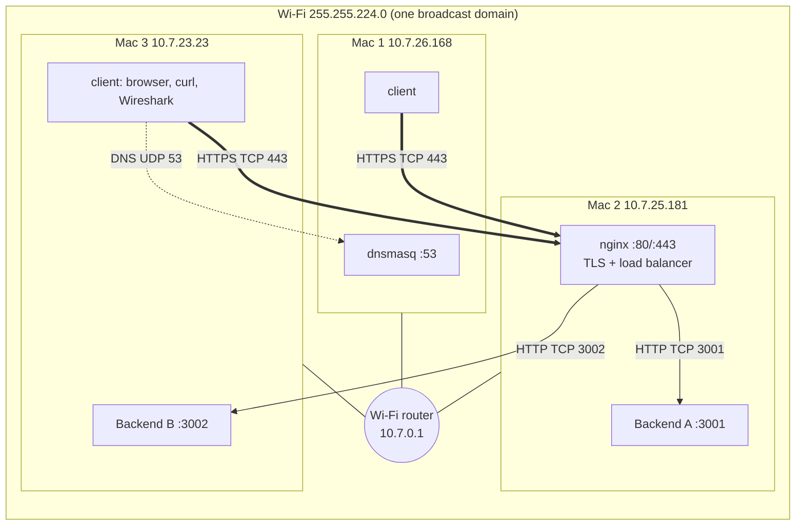
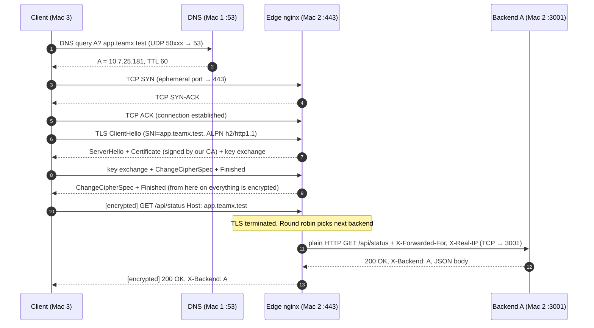

# Architecture Document: Phase 1

## 1. Network topology

**Infrastructure: three physical MacBooks on one Wi-Fi, four roles.** The PDF (section 3) allows combining roles for teams of 2–3:

| PDF role | Runs on | Address |
|---|---|---|
| Mac 1: DNS server + test client | Mac 1 (Yash Raj) | 10.7.26.168:53 |
| Mac 2: Edge (nginx, TLS, load balancer) | Mac 2 (Yash Yadav) | 10.7.25.181:80/443 |
| Mac 3: Backend A | Mac 2 (Yash Yadav) | 10.7.25.181:3001 |
| Mac 4: Backend B + test client | Mac 3 (Aditya Samadhiya) | 10.7.23.23:3002 |

All three Macs are on the same Wi-Fi subnet 255.255.224.0 with the same default gateway 10.7.0.1. No routing between subnets, no NAT between our machines, no cloud. Backend B sits on a different Mac from the edge, so load balancing really crosses the network.

## 2. Machine roles and IP / service table

Fill in from `evidence/inventory/*.txt` (screenshots 01–06):

| Machine | Hostname | Interface | IPv4 | Mask / prefix | Gateway | MAC address |
|---|---|---|---|---|---|---|
| Mac 1 (DNS + client) | Yashs-MacBook-Pro-10.local | en0 (Wi-Fi) | 10.7.26.168 | 255.255.224.0 (/19) | 10.7.0.1 | ce:fb:cd:24:3f:5b |
| Mac 2 (edge + Backend A) | Adityas-MacBook-Pro-21.local | en0 (Wi-Fi) | 10.7.25.181 | 255.255.224.0 (/19) | 10.7.0.1 | 92:ef:45:8e:e9:ee |
| Mac 3 (Backend B + client) | Yashs-MacBook-Pro-666.local | en0 (Wi-Fi) | 10.7.23.23 | 255.255.255.0 (/24) | 10.7.0.1 | 5a:a7:58:2e:bc:1e |

### Service map

| Machine | Service | Listens on | Protocol | Who connects to it |
|---|---|---|---|---|
| Mac 1 | dnsmasq | 10.7.26.168:53, 127.0.0.1:53 | DNS over UDP (TCP for big answers) | Every client |
| Mac 2 | nginx | `*:80` | HTTP, only redirects to HTTPS and serves `/ca.crt` | Clients |
| Mac 2 | nginx | `*:443` | HTTPS (TLS 1.2/1.3, HTTP/1.1 + HTTP/2 via ALPN) | Clients |
| Mac 2 | Backend A (`server.py`) | `0.0.0.0:3001` | Plain HTTP/1.1 | Only the edge |
| Mac 3 | Backend B (`server.py`) | `0.0.0.0:3002` | Plain HTTP/1.1 | Only the edge |

### DNS records (dnsmasq on Mac 1)

| Name | Type | Value | TTL |
|---|---|---|---|
| `app.teamx.test` | A | Mac 2 IP (edge) | 60 s |
| `api.teamx.test` | A | Mac 2 IP (edge) | 60 s |
| `mac1…mac4.teamx.test` | A | the IP of the Mac running that role | 60 s |
| anything else under `teamx.test` | | NXDOMAIN (we are authoritative, `local=/teamx.test/`) | |
| everything else | | forwarded to `8.8.8.8` | |

Both service names point at the **edge**, never at a backend, so clients never need backend IPs.

## 3. Request flow, layer by layer

What happens when the client on Mac 3 runs `curl https://app.teamx.test/api/status`:

### Which layer does what

| Step | OSI layer | TCP/IP layer | Protocol | Ports | What it is used for |
|---|---|---|---|---|---|
| Name → IP | 7 Application | Application | DNS | client ephemeral → **UDP 53** | Find *where* the service is |
| Carry DNS | 4 Transport | Transport | UDP | | One question, one answer, no connection needed |
| Reliable byte stream | 4 Transport | Transport | TCP | client ephemeral → **TCP 443** | 3-way handshake, sequence/ack numbers, retransmission |
| Encryption + server identity | 5/6 Session/Presentation | (between Transport and Application) | TLS 1.2 / 1.3 | inside TCP 443 | Confidentiality, integrity, proving the server is really app.teamx.test |
| The request itself | 7 Application | Application | HTTP/1.1 or HTTP/2 | | GET, headers, status codes, caching |
| Getting between Macs | 3 Network | Internet | IPv4 | | Source/destination IP addresses on the same subnet |
| On the Wi-Fi | 2 Data link | Link | 802.11 / Ethernet frames, ARP | | MAC addresses, the router delivers the frame |
| Edge → backend | 7 + 4 | App + Transport | HTTP over TCP | edge ephemeral → **3001 / 3002** | A second, separate TCP connection. TLS has already ended. |

Notice that **two separate TCP connections** carry each request: client to edge (encrypted) and edge to backend (plain). The backend sees the edge's IP as its TCP peer, which is why nginx adds `X-Forwarded-For` / `X-Real-IP` so the backend still knows who the real client is.

## 4. Our setup vs the cloud

| Our component | What it does | Cloud equivalent |
|---|---|---|
| dnsmasq | Answers for a private zone, forwards the rest | AWS Route 53 private hosted zone, Cloud DNS |
| nginx edge | One public entry point, TLS termination, spreads load, health checks | AWS ALB / NLB, GCP HTTPS Load Balancer, CDN edge node (CloudFront) |
| Backends A and B | Identical stateless app servers | EC2 instances / containers in a target group |
| Our local CA | Issues the server certificate that clients trust | AWS ACM / Let's Encrypt (publicly trusted CAs) |
| The Wi-Fi LAN | Private network between machines | VPC + subnet |
| `Cache-Control` / `ETag` | Lets clients and caches reuse responses | CDN caching (CloudFront, Cloudflare) |

## 5. Design choices

- **Round robin** (nginx default) because both backends are identical. `least_conn` would matter only if requests took very different amounts of time.
- **Passive health checks** (`max_fails=1 fail_timeout=10s` + `proxy_next_upstream`): if a backend refuses a connection, nginx retries the same request on the other one and skips the dead one for 10 s. The client never sees an error. (Active health checks are an nginx Plus feature.)
- **TLS terminates at the edge.** The backends stay simple HTTP, and there's one place to manage certificates. The trade-off is that the edge→backend hop is plaintext on the LAN (fine for a private network; production would use mTLS or a private VPC).
- **Same content = same ETag on both backends.** `/api/info` hashes identical bytes on A and B, so a conditional request gets a 304 no matter which backend the load balancer picks.
- **Combining roles (3-Mac team):** Backend A shares Mac 2 with the edge. That's allowed by the PDF. DNS (Mac 1) and the edge (Mac 2) are each a single point of failure; Phase 2 adds a backup resolver and a standby edge.
- **Backend A on the edge Mac:** nginx reaches it at 10.7.25.181:3001. That traffic never leaves the Mac (it goes over the loopback interface), while traffic to Backend B crosses the Wi-Fi. Round robin treats both the same.
